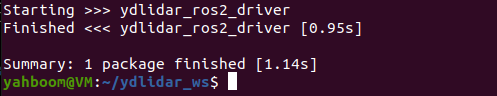
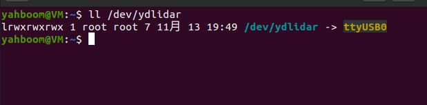
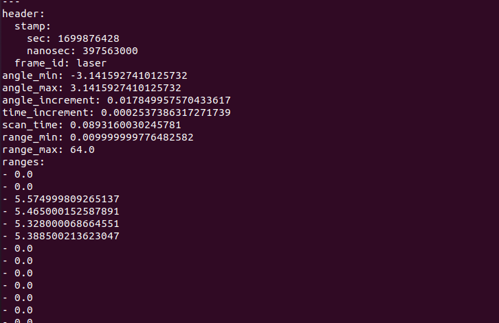
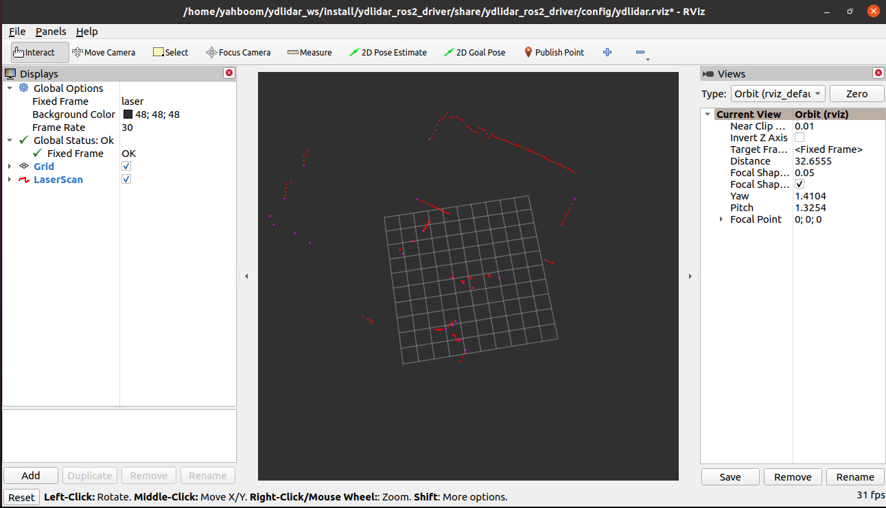

# YDLidar RDKX5 上位机应用

**在小车环境已经配置好的情况下，请直接看第五部分之后**

## 目录
- [一、代码组成](#一代码组成)
- [二、环境搭建](#二环境搭建)
- [三、使用方法](#三使用方法)
- [四、配置参数](#四配置参数)
- [五、需要注意的地方](#五需要注意的地方)
- [六、启动顺序](#六启动顺序)
- [七、常见问题](#七常见问题)
- [八、文件索引](#八文件索引)

## 一、代码组成

本项目包含以下核心组件：

### 1. YDLidar-SDK（C++ 核心库）
- 位置：`YDLidar-SDK-master/`
- 功能：提供激光雷达通信协议解析、串口/网络连接、数据处理等核心功能
- 架构：
  - `core/` - 核心库（串口、网络、数学库）
  - `samples/` - 示例程序
  - `python/` - Python 绑定
  - `csharp/` - C# 绑定

### 2. ydlidar_ros2_driver（ROS2 驱动）
- 位置：`src/ydlidar_ros2_driver-master/`
- 功能：将激光雷达数据发布为 ROS2 sensor_msgs/LaserScan 话题
- 关键目录：
  - `launch/` - 启动文件
  - `params/` - 配置文件
  - `src/` - 驱动源码

### 3. 通信连接
- 激光雷达通过**串口**连接到上位机（RDKX5）
- 默认串口：`/dev/ydlidar`（需映射到实际设备如 `/dev/ttyUSB0`）
- 波特率：`512000`

---

## 二、环境搭建

### 2.1 安装SDK

解压【源码】文件夹下的 `YDLidar-SDK-master.tar.xz`，得到 `YDLidar-SDK-master` 文件夹，在该文件夹下打开终端，输入：

```bash
mkdir build
cd build
cmake ..
make -j4
sudo make install
```


### 2.2 编译功能包

解压【源码】文件夹下的 `ydlidar_ros2_driver-master`，得到 `ydlidar_ros2_driver-master` 功能包。把 `ydlidar_ros2_driver-master` 复制到自己的工作空间的 `src` 目录下，这里以工作空间名为 `ydlidar_ws` 为例子，`rplidar_ws` 的路径是在 `~` 目录下，然后回到工作空间目录下，进行编译：

```bash
cd ~/ydlidar_ws
colcon build --symlink-install
```



出现以上画面说明，编译通过。然后输入以下命令设置环境变量：

```bash
echo "source ~/ydlidar_ws/install/setup.bash --extend" >> ~/.bashrc
```

### 2.3 绑定雷达端口

终端输入：

```bash
cd ~/ydlidar_ws/src/ydlidar_ros2_driver-master/startup
sudo chmod 777 initenv.sh
sudo bash initenv.sh
```

然后重新拔插雷达串口，终端输入：

```bash
ll /dev/ydlidar
```



出现以上内容则表示绑定成功，结尾不一定是 0，根据插入设备的顺序而改变。注意绑定后
一定要每次开机确认lidar是否在自己绑定的端口

### 2.4 运行launch

运行雷达：

```bash
ros2 launch ydlidar_ros2_driver x3_ydlidar_launch.py
```

通过以下命令可以查看雷达节点数据：

```bash
ros2 topic echo /scan
```



运行雷达显示点云，终端输入（需要 ctrl c 关闭之前启动雷达的节点）：

```bash
# x3/x3pro雷达
ros2 launch ydlidar_ros2_driver ydlidar_x3_view_launch.py
```



---

## 三、使用方法

### 3.1 构建步骤

#### 步骤 0：构建工作空间
```bash
source /opt/ros/humble/setup.bash  ##按照具体ROS2版本配置
mkdir -p ~/ydlidar_ws
```
将仓库下的src移动到~/ydlidar_ws下

#### 步骤 1：构建 YDLidar-SDK

```bash

cd ~/ydlidar_ws/YDLidar-SDK-master
mkdir -p build && cd build
cmake .. && make -j4
sudo make install
```

#### 步骤 2：构建 ROS2 Driver

```bash
cd ~/ydlidar_ws
source /opt/ros/humble/setup.bash
colcon build --symlink-install
```

#### 步骤 3：设置环境变量

```bash
source ~/ydlidar_ws/install/setup.bash
```
最好将环境变量写入.bashrc中
### 3.2 运行步骤

#### 步骤 1：检查串口设备

确认激光雷达连接的串口设备名称：

```bash
ls -l /dev/ttyUSB*
```
查看是否是自己绑定的端口
#### 步骤 2：配置串口别名（可选）

```bash
sudo chmod 0777 src/ydlidar_ros2_driver/startup/*
sudo sh src/ydlidar_ros2_driver/startup/initenv.sh
```

然后重新插拔激光雷达。

#### 步骤 3：启动激光雷达

```bash
ros2 launch ydlidar_ros2_driver ydlidar_launch.py
```

#### 步骤 4：查看扫描数据(可选)

```bash
ros2 topic echo /scan
```

#### 步骤 5：RViz 可视化（可选）

```bash
ros2 launch ydlidar_ros2_driver ydlidar_launch_view.py
```

---

## 四、配置参数

### 4.1 串口配置（必须修改）

文件：`src/ydlidar_ros2_driver-master/params/ydlidar.yaml`

| 参数 | 默认值 | 说明 |
|------|--------|------|
| `port` | /dev/ydlidar | **串口设备名**，需改为实际设备如 `/dev/ttyUSB0` |
| `baudrate` | 512000 | 波特率，根据激光雷达型号选择 |

### 4.2 其他常用参数

| 参数 | 默认值 | 说明 |
|------|--------|------|
| `frame_id` | laser | TF 坐标系名称 |
| `frequency` | 10.0 | 扫描频率（Hz） |
| `angle_max` | 180.0 | 最大角度 |
| `angle_min` | -180.0 | 最小角度 |
| `range_max` | 64.0 | 最大测距（米） |
| `range_min` | 0.01 | 最小测距（米） |

---

## 五、需要注意的地方

### 5.1 串口设备名

切换网络不会改变串口连接，但如果重新插拔激光雷达，串口设备名可能变化（如从 `/dev/ttyUSB0` 变为 `/dev/ttyUSB1`）。

**解决方法**：
- 方案 1：使用串口别名
  ```bash
  # 创建 udev 规则
  sudo nano /etc/udev/rules.d/99-ydlidar.rules
  # 添加：SUBSYSTEM=="tty", ATTRS{idVendor}=="xxxx", ATTRS{idProduct}=="xxxx", SYMLINK+="ydlidar"
  ```
- 方案 2：每次确认设备名，确认雷达的串口是否正确
  ```bash
  ls -l /dev/ttyUSB*
  ```
### 5.2 代码修改

trans.py中的ttyUSB1为实际与下位机连接的USB
```bash
# 配置与STM32连接的串口 (根据RDK X5实际引脚修改)
try:
    ser = serial.Serial('/dev/ttyUSB1', 115200, timeout=1)
    print("串口 /dev/ttyUSB1 打开成功")
except Exception as e:
    print(f"串口打开失败: {e}")
    ser = None
  ```

UI.html中的IP为小车的网络IP
```bash
<script>
        // --- WebSocket 设置 ---
        const WS_URL = "ws://192.168.110.99:8765"; // 保持正确的IP
        let ws;
  ```

## 六、启动顺序

### 步骤1: 启动本地网页端
新建一个终端，确保路径是在~/ydlidar_ws/src
  ```bash
python3 -m http.server 8080
  ```
### 步骤2: 启动上位机控制
新建一个终端，确保路径是在~/ydlidar_ws/src,此时确保
  ```bash
python3 trans.py
  ```
手机与小车在同一个wifi后，查看网址，此时建图功能未开启，但可以控制小车方向了
，如果无法控制见第七部分
  ```bash
http://192.168.110.99:8080/UI.html 
## IP地址为小车实际地址
## 也是HTML中的实际填写地址
  ```
### 步骤3: 启动 YDLIDAR 驱动节点：
  ```bash
ros2 launch ydlidar_ros2_driver x3_ydlidar_launch.py
  ```
### 步骤4: 启动 SLAM 建图功能：
  ```bash
ros2 launch slam_gmapping slam_x3_gmapping.launch.py
 ```
此时可以在rviz或手机端中查看建图效果了


## 七、常见问题

### Q1: 激光雷达无法启动

- 检查串口设备名是否正确
- 检查波特率是否匹配
- 确认有权限访问串口：`sudo usermod -a -G dialout $USER`，然后重新登录

### Q2: 下位机接受不到信息
- 检查串口设备名是否正确
- 检查波特率是否匹配
- 尝试复位下位机

### Q3: 手机第一次开启热点或初次配置wifi
常用的wifi配置指令
  ```bash
sudo nmcli dev wifi rescan ##重新扫描wifi
nmcli dev wifi list ##查看扫描结果
sudo nmcli dev wifi connect "lazy" password "BurNIng123" ##wifi连接 第一个字段是名称 第二个是密码
nmcli connection show ##查看已经保存的wifi连接配置
sudo nmcli connection delete lazy ##删除之前的wifi配置
  ```

---

## 八、文件索引

| 用途     | 文件路径                                                      |
|--------|-----------------------------------------------------------|
| 串口配置   | `src/ydlidar_ros2_driver-master/params/ydlidar.yaml`      |
| 启动文件   | `src/ydlidar_ros2_driver-master/launch/ydlidar_launch.py` |
| 驱动源码   | `src/ydlidar_ros2_driver-master/src/*.cpp`                |
| SDK 核心 | `YDLidar-SDK-master/core/`                                |
| 网页端    | `src/*.HTML`                                              |
| 下位机控制  | `src/trans.py`                                            |